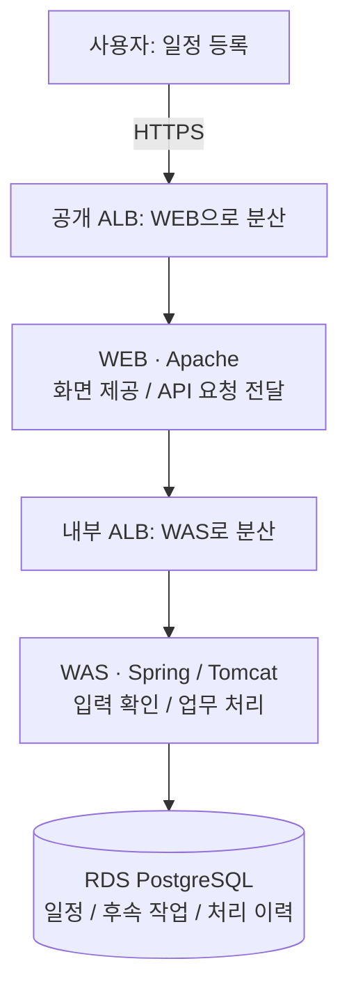
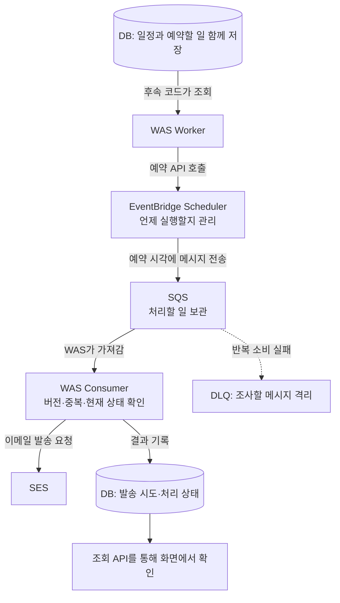

# Daylight

**4명이 함께 일정을 관리하고, 필요한 팀원에게 알림을 보내는 팀 캘린더를 만들고 있습니다.**

현재는 **Daylight 화면 시안**과 **Deadline Companion 백엔드**가 각각 구현되어 있습니다. 두 부분을 연결해 팀 공유·이메일 알림으로 확장하는 단계입니다.

[🌤 Daylight 체험](https://main.d1za53r0rfy3x6.amplifyapp.com/) · [📖 아키텍처 쉽게 읽기](https://app.notion.com/p/3d7d9d5f6b3a81359f18c9aeec3376ed) · [🎤 15분 발표](https://app.notion.com/p/3d7d9d5f6b3a813090b5cbeb9af817b2)

> **체험 사이트는 정적 미리보기입니다.** 일정은 각자의 브라우저에만 저장됩니다. 다른 팀원과 데이터가 공유되거나 실제 이메일이 발송되지는 않습니다. 팀원 선택도 로그인 기능은 아닙니다. 노션 자료는 별도 열람 권한이 필요할 수 있습니다.

## 1. 무엇을 만드는 프로젝트인가요?

팀원의 일정을 한곳에서 보고, 등록·예약·발송 상태를 확인할 수 있는 서비스가 목표입니다.

예를 들어 **내일 14시 접수 마감 → 60분 전인 13시 알림**을 등록합니다. 사용자가 저장 후 계속 화면을 켜 두지 않아도 서버가 후속 작업을 처리하는 방향입니다.

이 저장소에는 다음 두 부분이 있습니다.

| 구분 | Daylight | Deadline Companion |
| --- | --- | --- |
| 역할 | 새 팀 캘린더 화면 시안 | 기존 일정·예약 알림 서비스 기반 |
| 화면 소스 | [daylight/](daylight) — HTML·CSS·JavaScript | [frontend/](frontend) — React·TypeScript |
| 데이터 | 각 브라우저의 localStorage | [backend/](backend)를 통한 PostgreSQL 저장 |
| 사용 범위 | 4명 프로필·일정·알림 대상 미리보기 | 단일 소유자의 일정 등록·조회·수정·취소·이력 |
| 알림 | 브라우저 안의 등록 알림 | Scheduler·SQS·SES 연동 코드, 실제 수신 검증은 별도 |
| 연결 상태 | **백엔드 미연결** | 로컬 WEB→WAS→DB 동작 확인 |

**같은 저장소에 있다고 이미 하나의 서비스로 연결된 것은 아닙니다.**

## 2. 지금 어디까지 되나요?

기준: **2026-09-10**. 소스 구현, 로컬 확인, 공개 배포를 구분합니다.

| 기능 | 현재 상태 |
| --- | --- |
| 팀원 4명 선택·이름·역할 수정 | Daylight에서 가능. 인증·가입은 아님 |
| 현재 날짜, 연·월·일 선택, 주간 일정 | Daylight에서 가능 |
| 일정 등록·카테고리 관리·대상별 등록 알림 | 브라우저 내 저장·미리보기 |
| PC 확대 레이아웃·모바일 메뉴 도구 | 최신 소스에 반영. 공개 사이트에는 아직 미배포 |
| 기존 서비스 일정 수정·취소·처리 이력 | 로컬 3-Tier에서 확인 |
| 예약 생성·큐 소비·메일 요청 | 백엔드 코드 구현. 운영 설정·실수신 확인 필요 |
| 팀원 간 공유·다중 사용자 인증 | **미구현** |
| 실제 팀원 이메일 발송 | **미연결·미검증** |
| CloudWatch → SNS 운영자 통보 | 알람 정의는 있으나 **SNS 연결 미구현** |
| AWS 3-Tier 운영·장애 조치 검증 | 현재 서비스의 운영 검증은 남아 있음 |

Daylight 공개 사이트는 AWS Amplify의 **수동 배포**입니다. GitHub에 푸시해도 사이트가 자동 갱신되지는 않습니다. 현재 배포본에는 날짜 선택과 `‹ 오늘 ›`의 투명 스타일까지 반영되어 있습니다.

## 3. 아키텍처는 두 가지 길로 이해합니다

아래는 **기존 백엔드와 Terraform이 정의하는 구조**입니다. Daylight 정적 사이트가 이 모든 서비스를 사용 중이라는 뜻은 아닙니다.

### 길 ① 지금 일정을 저장하는 길



- **WEB은 전달합니다.** 화면 파일을 제공하고 업무 요청을 WAS로 넘깁니다.
- **WAS는 판단합니다.** 입력과 소유자를 확인하고 알림 시각을 계산합니다.
- **DB는 기억합니다.** 일정과 처리 상태를 저장합니다.

저장 결과는 WAS·WEB과 ALB를 거쳐 사용자에게 돌아옵니다. 사용자가 DB에 직접 접속하지 않습니다. 화면 파일 요청은 WEB에서 응답할 수 있어 모든 요청이 DB까지 내려가는 것도 아닙니다.

ALB는 요청을 나누는 장치입니다. ALB가 두 개라고 업무 계층이 5개가 되는 것은 아닙니다.

### 길 ② 나중에 알림을 처리하는 길



| 이름 | 쉬운 설명 |
| --- | --- |
| Outbox | 일정과 함께 DB에 적어 두는 **후속 작업 목록** |
| Worker / Consumer | 목록·큐를 처리하는 **WAS 안의 코드**. 별도 서버가 아님 |
| Scheduler | 미래 시각에 작업을 실행하도록 예약 |
| SQS | 서버가 가져갈 작업을 보관하는 대기 줄 |
| SES | 이메일 발송을 요청하는 서비스 |
| DLQ | 반복 실패한 메시지를 분리해 조사하는 큐. 자동 수리 기능은 아님 |

일정 등록 응답은 미래의 메일 발송 완료를 기다리지 않습니다. 외부 연동과 서버가 정상 작동하는 조건에서 후속 처리가 진행됩니다.

**저장 완료 ≠ 예약 완료 ≠ 발송 요청 수락 ≠ 메일 수신·열람**입니다. 사용자는 서버에 기록된 상태를 조회하며, 실제 메일 도착·읽음까지 확인하는 연동은 없습니다.

SQS 메시지는 읽었다고 바로 삭제되지 않습니다. 처리 결과가 재시도 대상인지에 따라 삭제 여부를 정합니다. 외부 메일 발송과 DB 기록은 하나의 원자적 작업이 아니므로 모든 장애에서 정확히 한 번 발송을 보장하지는 않습니다.

## 4. 보안·장애·운영은 어떻게 받쳐 주나요?

| 관점 | 현재 코드가 준비한 구조 | 주의할 점 |
| --- | --- | --- |
| 통신 제한 | 공개 ALB → 사설 WEB·WAS → 격리 DB, 계층별 Security Group | Private 배치만으로 사용자 인증이 해결되지는 않음 |
| AWS 권한·비밀 | IAM 역할, Secrets Manager, DB 계정 분리 | 코드·Git에 실제 비밀값을 넣지 않음 |
| 고가용성 | 2개 AZ의 WEB·WAS, ALB·ASG, RDS Multi-AZ 설정 | 실제 전환 시간·남은 서버 용량은 시험 필요 |
| 실패 추적 | Outbox 기록, 큐·DLQ, 발송 시도 이력 | 불명확한 발송을 무조건 재시도하면 중복 위험 |
| 운영 관찰 | CloudWatch 로그·지표·알람 정의 | SNS 통보 연결과 수신 확인은 별도 |
| 재현성 | Terraform, Docker Compose, Flyway | 정적 검사 통과가 운영 배포 완료를 뜻하지 않음 |

현재 WAS는 API와 Worker를 포함한 **단일 Spring 애플리케이션**입니다. 독립 마이크로서비스나 전체 서버리스 구조는 아닙니다. 외부 HTTPS와 달리 내부 WEB–WAS 구간은 현재 HTTP이며, ASG의 기본 수량 유지와 부하 기반 자동 증설 정책도 구분해야 합니다.

자세한 포트·서브넷·장애 경로는 [아키텍처 안내](docs/architecture/middleproject-aws-3tier-architecture.md)와 [다이어그램 원본](docs/architecture/middleproject-aws-3tier-architecture.drawio)에 있습니다.

## 5. 내 PC에서 실행하기

### Daylight 화면만 보기

필요한 것: Python 3. 저장소 루트에서 실행합니다.

```bash
python3 -m http.server 8093 --bind 127.0.0.1 --directory daylight
```

[로컬 Daylight 열기](http://127.0.0.1:8093/) · 이미 사용 중인 포트라면 다른 번호를 선택하세요.

서버 DB를 사용하지 않으며, 브라우저 저장소를 지우면 일정도 사라집니다. 로컬 주소와 AWS 주소의 저장소는 별개입니다.

### 기존 백엔드와 DB까지 실행하기

필요한 것: Docker Engine, Docker Compose v2.

1. `.env`가 없을 때만 `.env.example`을 복사합니다. 기존 파일은 덮어쓰지 마세요.
2. `LOCAL_DB_ADMIN_PASSWORD`, `LOCAL_DB_MIGRATION_PASSWORD`, `LOCAL_DB_APP_PASSWORD`에 서로 다른 암호를 설정합니다. 기존 DB를 사용한다면 `LOCAL_OWNER_ID`를 유지합니다.
3. 저장소 루트에서 실행합니다.

```bash
docker compose up -d --build
docker compose ps
curl --fail http://127.0.0.1:8088/healthz
```

[기존 서비스 열기](http://127.0.0.1:8088/) · 이 주소는 Daylight가 아니라 React 기반 기존 대시보드입니다.

로컬은 접속 코드 없이 사용하며 AWS 예약·큐·메일은 기본 비활성입니다. **무인증 로컬 API를 외부 공개하거나 터널링하지 마세요.**

종료는 `docker compose down`입니다. DB 볼륨은 유지됩니다. `-v`를 추가하면 데이터가 삭제되므로 일반 종료에는 사용하지 마세요. 자세한 설정은 [실행·배포 런북](docs/runbooks/service-mvp.md)을 확인합니다.

## 6. 발표·학습 자료

README는 전체 흐름을 파악하는 입구입니다. 세부 설명은 아래 문서에서 이어집니다.

- [노션 전체 목차](https://app.notion.com/p/3d7d9d5f6b3a81359f18c9aeec3376ed): Phase 1~9 아래에 쉬운 설명 13개와 발표 대본 2개
- [Phase 9 · 15분 발표](https://app.notion.com/p/3d7d9d5f6b3a813090b5cbeb9af817b2): 시간 배분, 전반부·후반부 대본, 그림을 가리킬 순서
- [아키텍처 아틀라스 HTML](docs/architecture/architecture-atlas.html): 전체 구조와 구간별 설명
- [구현 사실·제약](memory/PRODUCT-TRUTH.md): 소스 구현과 운영 검증의 구분
- [기존 서비스 진행 기록](progress.json): 백엔드 구현 트랙. Daylight 팀 연동 완료표는 아님

15분 발표는 **목적 → 등록 → 예약·발송 → 보안 → 장애 대응 → 현재 한계** 순서로 구성합니다. 설정값을 전부 읽기보다 화살표마다 “무엇을 넘기고, 왜 다음 단계가 필요한지” 설명합니다.

## 7. 팀원이 코드를 찾는 곳

```text
middleproject/
├── daylight/               새 팀 캘린더 정적 시안
├── frontend/               기존 React 대시보드
├── backend/                Spring 업무·예약·발송 코드와 DB 마이그레이션
├── infra/local/            Apache·Tomcat·PostgreSQL 로컬 구성
├── infra/terraform/        AWS 3-Tier 인프라 정의
├── scripts/                Daylight 수동 배포 도구
├── docs/architecture/      아키텍처 그림·설명
└── docs/runbooks/           실행·배포·복구 절차
```

현재 작업 브랜치는 `codex/service-mvp-pastel-dashboard`입니다. 기본 `main`에 최신 변경이 모두 병합된 상태는 아닙니다. 팀원은 작업 브랜치를 확인하고 각자 브랜치에서 변경한 뒤 PR로 공유하세요.

## 8. 다음에 연결할 것

1. **팀 인증·권한:** 화면의 팀원 선택과 실제 로그인·멤버십을 분리
2. **공유 저장:** 팀·일정·알림 수신자를 서버 DB에 저장하고 Daylight API 연결
3. **이메일 알림:** 등록 알림과 사전 예약 알림을 구분하고, 수신자별 비동기 처리·결과 기록 연결
4. **운영 확인:** AWS 사용자 흐름·실메일 수신·실패 대응·운영자 통보 검증

Bedrock·SageMaker 같은 AI 기능은 위의 핵심 흐름을 대신하지 않으며 현재 연결되어 있지 않습니다.

<details>
<summary>개발자용 검사 명령</summary>

화면이나 문서만 바꿀 때마다 아래 전체 검사를 반복할 필요는 없습니다. 변경 범위에 맞는 검사를 선택합니다.

```bash
# 기존 React 프론트엔드
cd frontend
npm ci --include=dev
npm run typecheck
npm test
npm run build
```

```bash
# 저장소 루트에서 시작, JDK 21 필요
cd backend
./gradlew test bootWar --no-daemon
```

```bash
# 저장소 루트에서 Terraform 정적 검사
terraform -chdir=infra/terraform fmt -check
terraform -chdir=infra/terraform init -backend=false
terraform -chdir=infra/terraform validate
```

실제 AWS 생성·변경, DNS 변경, 외부 메일 발송은 정적 검사와 다른 작업입니다. 대상·권한·비용과 실행 범위를 확인한 뒤 진행합니다.

</details>
