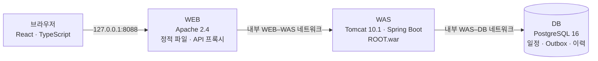
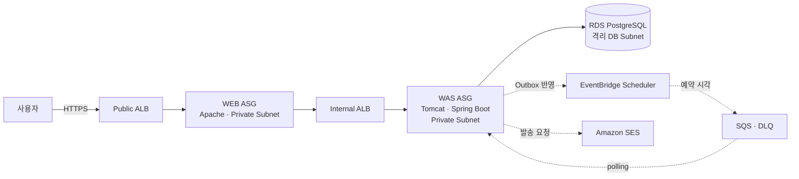
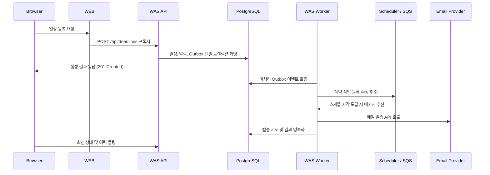

# Deadline Companion

놓치기 쉬운 접수·예매·제출 일정을 등록하면, 서버가 예약부터 발송까지 전 과정을 추적·관리하는 **개인용 일정 알림 웹서비스**입니다.

> **핵심 설계**: 클라이언트 요청과 실제 알림 발송을 분리합니다. 일정 저장 완료, 외부 프로바이더의 발송 접수, 실제 수신 확인을 서로 다른 단계로 구분하고 시스템이 관찰한 상태만 영속화합니다.

## 한눈에 보기

| 항목 | 구성 |
| --- | --- |
| 사용자 화면 | React · TypeScript · PWA |
| WEB 계층 | Apache 2.4 (정적 리소스 서빙 및 `/api/` 리버스 프록시) |
| WAS 계층 | Java 21 · Spring Boot · 외장 Tomcat 10.1 (단일 WAR) |
| 데이터 계층 | PostgreSQL 16 · Flyway |
| 배포 환경 | 로컬 Docker Compose / AWS (Terraform 기반 IaC) |
| 아키텍처 | 물리적 WEB–WAS–DB 3-Tier 기반 계층형 모놀리스 |
| 현재 상태 | 로컬 3-Tier 검증 완료 (AWS 스택 및 실메일 수신은 미검증) |

## 주요 기능

* **일정 라이프사이클 관리**: 등록, 조회, 수정, 취소
* **중복 요청 방지**: Idempotency Key 기반 멱등성 보장
* **동시성 제어**: 낙관적 잠금(Optimistic Locking)을 통한 화면 덮어쓰기 방지 (`409 Conflict`)
* **영속적 이력 추적**: 예약 반영 및 알림 발송 시도 내역 저장
* **비동기 알림 파이프라인**: Outbox 패턴 → Scheduler → Queue 기반 처리
* **반응형 대시보드**: 검색, 상태 필터링, 월간 캘린더 및 날짜별 조회
* **화면 자동 동기화**: 활성 화면 30초 주기 자동 갱신, 브라우저 탭 활성화 및 네트워크 복구 시 즉시 갱신
* **발송 상태 세분화**: 알림 비활성, 발송 접수 완료, 발송 실패, 결과 불명확(`DELIVERY_UNKNOWN`) 상태 분리 기록

## 로컬 실행 방법

사전 요구사항: Docker Engine 및 Docker Compose v2

### 1. 환경 변수 설정

```bash
cp .env.example .env
openssl rand -hex 24

```

`.env` 파일 내 세 가지 DB 암호에 각각 고유한 임의값을 지정합니다. 기존 DB 볼륨을 재사용할 경우 `LOCAL_OWNER_ID` 값은 유지해야 합니다.

```dotenv
LOCAL_DB_ADMIN_PASSWORD=<관리자_암호>
LOCAL_DB_MIGRATION_PASSWORD=<마이그레이션_암호>
LOCAL_DB_APP_PASSWORD=<애플리케이션_암호>
LOCAL_OWNER_ID=local-owner

```

### 2. 빌드 및 컨테이너 실행

```bash
docker compose up -d --build
docker compose ps
curl --fail http://127.0.0.1:8088/healthz

```

브라우저에서 [http://127.0.0.1:8088](http://127.0.0.1:8088)에 접속합니다. 로컬 미리보기 모드는 별도의 인증 코드를 요구하지 않습니다.

### 3. 컨테이너 종료

```bash
docker compose down

```

`docker compose down` 실행 시 PostgreSQL 볼륨 데이터는 유지됩니다. 저장된 일정 데이터를 완전히 초기화하려면 `docker compose down -v` 옵션을 사용합니다.

> **보안 주의사항**: 로컬 무인증 모드는 `127.0.0.1`(Loopback) 전용입니다. 포트를 외부에 바인딩하거나 터널링하지 마십시오. 구체적인 런타임 제약 및 보안 수칙은 [Service MVP Runbook](docs/runbooks/service-mvp.md)을 참조하십시오.

## 아키텍처

본 프로젝트는 **배포 경계와 코드 경계를 분리**합니다. 인프라는 WEB, WAS, DB의 3-Tier로 물리적 분리를 적용하되, WAS 내부의 비즈니스 로직은 단일 애플리케이션(모놀리스)으로 패키징 및 배포합니다.

### 로컬 3-Tier 구조



로컬 환경에서는 호스트의 Loopback 포트에 WEB 컨테이너만 노출됩니다. WAS 및 DB는 외부 포트를 개방하지 않으며 내부 브리지 네트워크를 통해서만 통신합니다. 로컬 기본 설정에서는 AWS EventBridge Scheduler, SQS, SES 연동 기능이 비활성화됩니다.

### AWS 3-Tier 목표 구조



AWS 인프라는 Terraform으로 구성되며, 서울 리전(ap-northeast-2) 내 2개 가용 영역(AZ)에 걸쳐 배치됩니다. WEB/WAS Auto Scaling Group 용량 및 RDS Multi-AZ 여부는 Terraform 변수로 제어할 수 있습니다. 현재는 인프라 코드만 유지된 상태이며, **실행 중인 AWS 리소스와 실제 이메일 수신은 아직 검증하지 않았습니다.**

### 계층별 역할 정의

| 계층 | 주요 역할 | 구현 위치 |
| --- | --- | --- |
| **WEB** | React/PWA 정적 에셋 서빙, Same-Origin API 리버스 프록시, 공개 엔드포인트 | [`frontend`](frontend), [`infra/local/httpd`](infra/local/httpd), [`web.sh.tftpl`](infra/terraform/templates/web.sh.tftpl) |
| **WAS** | 사용자 인증, 요청 검증, 트랜잭션 처리, 스케줄링 동기화, 큐 폴링 및 발송 이력 기록 | [`backend`](backend), [`was.sh.tftpl`](infra/terraform/templates/was.sh.tftpl) |
| **DB** | 일정, 알림, Outbox 이벤트, 발송 이력, 멱등성 메타데이터 영속화 | [Flyway migration](backend/src/main/resources/db/migration), [`tier.tf`](infra/terraform/tier.tf) |

S3, IAM, Secrets Manager, SSM, CloudWatch, NAT Gateway는 인프라 운영을 지원하는 보조 리소스이며, 독립적인 비즈니스 계층으로 구분하지 않습니다.

### 일정 등록 및 비동기 발송 흐름



클라이언트와의 HTTP 트랜잭션은 메일 발송 완료를 대기하지 않고 즉시 종료됩니다. 외부 연동이 활성화되면 WAS 백그라운드 워커가 큐를 통해 발송 작업을 비동기로 처리하므로, 브라우저 세션이 종료되어도 서버 측 작업은 정상 진행됩니다. 프로바이더 응답 타임아웃 발생 시 무조건적인 재시도로 인한 중복 발송을 방지하기 위해 상태를 `DELIVERY_UNKNOWN`으로 격리합니다.

### WAS 내부 패키지 구조

| 패키지 | 역할 |
| --- | --- |
| `web` | REST API 엔드포인트, HTTP 요청 검증 및 응답 매핑 |
| `application` | 유스케이스 구현, 트랜잭션 경계 설정, 백그라운드 워커 관리 |
| `domain` | 핵심 도메인 모델(일정, 알림) 및 비즈니스 불변식(Invariant) 규칙 |
| `port` | 외부 시스템 연동을 위한 인터페이스 규격 |
| `infrastructure` | Spring JDBC/JdbcTemplate, AWS 연동(Scheduler, SQS, SES) 구현체 |

일부 애플리케이션 서비스가 `JdbcTemplate`에 직접 의존하므로 순수 헥사고날 아키텍처는 아닙니다. 현재 프로젝트 규모와 생산성을 고려하여 유지보수성과 책임 분리를 절충한 계층형 모놀리스 구조를 채택했습니다.

## 보안 아키텍처

* **로컬 보안 경계**: 로컬 환경은 단일 개발자 PC 환경을 전제로 한 무인증 모드입니다. Apache가 Host 헤더와 Same-Origin 요청을 제한하지만, 동일 로컬 머신 내 타 프로세스의 악의적 접근을 방어하는 다중 사용자 인증 계층은 아닙니다.
* **AWS 인증 체계**: AWS 배포 환경에서는 단일 소유자 전용 Bearer 토큰 인증을 적용합니다. (다중 사용자 회원가입 및 OAuth 미지원)
* **네트워크 격리**: AWS Security Group은 `Public ALB → WEB → Internal ALB → WAS → DB` 계층 순서에 필요한 트래픽만 허용하도록 정의합니다.
* **데이터베이스 권한 분리**: 관리자(Admin), 마이그레이션(Flyway), 런타임 애플리케이션(App) 계정을 엄격히 분리합니다. WAS 런타임은 RDS 관리자 및 Flyway 자격증명에 접근할 수 없습니다.
* **엔드포인트 보호**: Public ALB 레벨에서 레거시 엔드포인트(`/api/mcp`) 접근을 기본 차단(`404 Not Found`)합니다.
* **시크릿 관리**: 자격증명, `.env`, Terraform State/Plan 파일, 빌드 산출물은 형상 관리 대상에서 전면 제외합니다.

## 구현 현황

2026-09-08 기준 구현 및 검증 현황입니다.

| 영역 | 상태 | 상세 내용 |
| --- | --- | --- |
| 일정 도메인 (CRUD · 동시성 · 이력) | ✅ 로컬 검증 완료 | 브라우저 → Apache → Tomcat → PostgreSQL 전체 파이프라인 정상 동작 확인 |
| 대시보드 UI 및 자동 동기화 | ✅ 로컬 검증 완료 | 프론트엔드 단위/통합 테스트(23개 항목), 타입 검사, PWA 빌드 파이프라인 통과 |
| AWS 3-Tier IaC (Terraform) | 🟡 코드베이스 구현 | 인프라 정의 및 과거 배포 이력은 있으나 현재 실 리소스는 철거된 상태 |
| 운영 환경 HTTPS E2E 흐름 | ⏳ 검증 대기 | 도메인, SSL 인증서 발급, 계정 권한 확인 후 통합 테스트 예정 |
| 실제 이메일 발송 연동 | ⏳ 검증 대기 | Amazon SES 설정, 승인된 수신 주소 및 실발송 승인을 통한 E2E 수신 테스트 필요 |
| AI 기반 자연어 파서 고도화 | ⏸ 검토 보류 | 현재는 제한된 규칙 기반 파서를 사용하며, Bedrock/SageMaker 연동은 기능 검증 후 순차 도입 |

세부 마일스톤 및 완료 기준은 [`progress.json`](progress.json)과 [PRODUCT TRUTH](memory/PRODUCT-TRUTH.md)에 기술되어 있으며, 이전 마일스톤 기록은 [`docs/phases`](docs/phases)에서 확인할 수 있습니다.

## 향후 작업 계획

1. **단일 문장 기반 일정 초안 작성**: 기존 규칙 기반 파서(`POST /api/reminder-commands/parse`)를 등록 화면과 연동하여 파싱 결과 사전 검토 및 수정 UX 구현
2. **외부 연동 상태 모니터링**: 민감 정보를 제외한 외부 리소스(Scheduler, SQS, SES)의 연결 상태 대시보드 시각화
3. **AWS 프로덕션 환경 종합 검증**: HTTPS 실환경 구성 후 브라우저 흐름 및 SES 실메일 발송 종단 간(E2E) 테스트

현재 자연어 파싱은 정규화된 규칙 기반 엔진으로 구현되어 있습니다. LLM(Bedrock/SageMaker) 도입은 현재 워크플로우의 가치가 검증된 후 별도의 어댑터 패턴으로 점진 통합합니다.

## 테스트 및 검증 절차

### Frontend

```bash
cd frontend
npm ci --include=dev
npm test -- --run
npm run typecheck
npm run build

```

### Backend

```bash
cd backend
./gradlew clean test bootWar --no-daemon

```

### Terraform 정적 검증

```bash
terraform -chdir=infra/terraform fmt -check
terraform -chdir=infra/terraform init -backend=false
terraform -chdir=infra/terraform validate

```

정적 검증 명령어는 클라우드 리소스를 프로비저닝하지 않습니다. 실제 `plan`, `apply`, DNS 레코드 갱신 및 외부 발송 테스트는 작업 범위와 비용 승인 절차를 거친 후 실행합니다.

## 디렉터리 구조

| 경로 | 설명 |
| --- | --- |
| [`frontend`](frontend) | React/TypeScript 기반 웹 대시보드 및 PWA 구성 |
| [`backend`](backend) | Spring Boot 애플리케이션 소스, Flyway 마이그레이션 스크립트, 테스트 코드 |
| [`infra/local`](infra/local) | 로컬 컨테이너 실행 환경 (Apache, Tomcat, PostgreSQL) |
| [`infra/terraform`](infra/terraform) | AWS VPC, WEB/WAS/RDS 및 인프라 운영 리소스 IaC |
| [`docs/architecture`](docs/architecture) | 아키텍처 원칙, 제약 사항 및 불변식 정의서 |
| [`docs/runbooks`](docs/runbooks) | 로컬 환경 셋업, AWS 배포 및 장애 복구 매뉴얼 |
| [`docs/phases`](docs/phases) | 단계별 개발 및 검증 산출물 이력 |
| [`memory`](memory) | 프로젝트 주요 의사결정 기록(ADR) 및 제품 컨텍스트 |

## 관련 문서

* [Service MVP 실행 및 배포 런북](docs/runbooks/service-mvp.md)
* [Project Invariants (프로젝트 불변식)](docs/architecture/project-invariants.md)
* [Architecture v1.2 설계서](docs/architecture/architecture-v1.2.md)
* [Phase 11 HA 검증 런북](docs/runbooks/phase-11-ha-test.md)
* [진행 현황 트래커](progress.json)

프로젝트의 모든 기술적 기준과 형상은 Git 저장소를 단일 진실 공급원(Single Source of Truth)으로 삼습니다.
