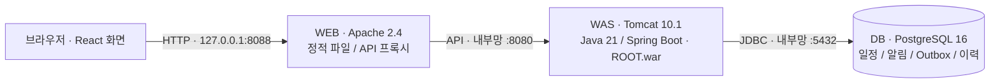
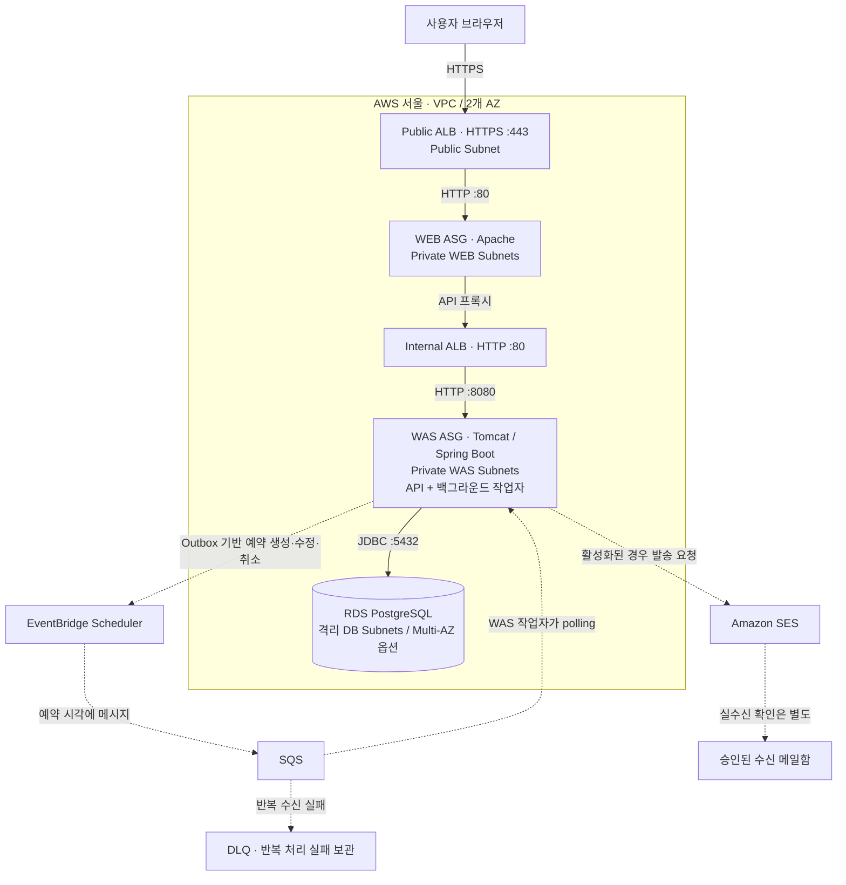

# Deadline Companion — Reliable Reminder Platform

놓치기 쉬운 접수·예매·제출 일정을 등록하고, 서버가 예약·발송 상태를 영속적으로 관리하는 본인용 일정 알림 웹서비스입니다.

현재 서비스 MVP에는 일정 등록·조회·수정·상태 취소, 낙관적 충돌 방지, 서버 Outbox/Scheduler/SQS 처리, 발송 이력, 단일 소유자 인증이 구현되어 있습니다. 로컬에서는 Apache WEB → 외장 Tomcat WAS → PostgreSQL 16의 세 계층을 Docker Compose로 재현합니다. AWS 배포와 실메일 수신은 별도 승인·설정이 필요한 최종 확인 항목입니다.

실행 방법과 비밀/DB 역할 분리는 [Service MVP Runbook](docs/runbooks/service-mvp.md)을 따릅니다. 이번 연속 구현 진행 원본은 [progress.json](progress.json)입니다.

## 현재 구현 상태

2026-09-08 소스 및 저장된 실행 기록 기준입니다. **로컬 동작 확인, AWS 배포 소스 구현, 실제 외부 서비스 검증을 구분합니다.**

| 범위 | 상태 | 확인된 내용 |
|---|---|---|
| S01–S04 · 서비스 기능 | 로컬 구현·확인 완료 | 일정 CRUD, 중복 요청·수정 충돌 처리, 이력, 소유자 인증, 배포 구성 |
| 프론트엔드 | 로컬 확인 완료 | 파스텔 대시보드, 실제 데이터 집계, 제목 검색, 상태·달력 필터, 반응형 화면 |
| S05 · 로컬 3-Tier | 확인 완료 | Apache → 외장 Tomcat → PostgreSQL의 API·브라우저 흐름과 영속성 |
| S05 · 현재 코드의 AWS HTTPS 배포 | 미확인 | Terraform 소스는 있으나 재배포 승인·설정 대기 |
| S05 · 실제 이메일 수신 | 미확인 | SES 어댑터는 있으나 실발송·수신 확인 대기 |
| Bedrock / SageMaker | 미구현·후순위 | 현재 서비스나 자연어 파서에 연결되어 있지 않음 |

> 마지막 AWS 운영 기록: 2026-08-15 KST에 Phase 11 검증 스택을 철거했습니다. 과거 배포 성공은 현재 서비스 코드의 AWS 운영 증거가 아닙니다. 현재 트랙의 완료 조건은 [progress.json](progress.json), 근거는 [PRODUCT-TRUTH](memory/PRODUCT-TRUTH.md)에 구분되어 있습니다.

## Architecture

**배포는 WEB / WAS / DB 3-Tier, 백엔드 애플리케이션은 하나의 WAR로 배포하는 계층형 모놀리스입니다.** 계층별 서버를 분리했다고 업무 기능마다 별도 서비스인 마이크로서비스가 되는 것은 아닙니다. API와 예약·발송 작업자는 같은 WAS 애플리케이션 안에서 실행됩니다.

### 1. 로컬 구성 — 동작 확인한 경로



- React·TypeScript 코드는 브라우저에서 실행되고 Apache는 빌드된 HTML/JS/CSS를 제공합니다. `/api/` 요청만 WAS로 전달합니다.
- [compose.yaml](compose.yaml)은 WEB만 loopback에 공개합니다. WAS와 DB는 호스트 포트를 열지 않고, WEB–WAS / WAS–DB 네트워크를 나눕니다.
- PostgreSQL은 Docker volume에 저장됩니다. 브라우저를 닫거나 WAS를 재시작해도 보존되며, 브라우저 저장소가 일정의 원본은 아닙니다.
- 기본 로컬 구성은 **AWS Scheduler·SQS·이메일을 모두 비활성화**합니다. 일정 저장·이력 확인은 가능하지만 실제 예약 실행이나 이메일 발송이 되는 데모는 아닙니다.

### 2. AWS 구성 — Terraform에 정의된 배포 경로

아래는 [Terraform 소스](infra/terraform)의 구조이며 **현재 운영 중인 서비스 그림이 아닙니다.** 실선은 사용자 요청·DB 접근, 점선은 예약·발송 작업입니다.



| 계층 | 책임 | 주요 소스 |
|---|---|---|
| WEB | React/PWA 배포, 정적 파일 제공, 같은 출처의 API 프록시 | [frontend](frontend), [Apache 설정](infra/local/httpd/reminder.conf), [WEB bootstrap](infra/terraform/templates/web.sh.tftpl) |
| WAS | 인증·입력 검증·일정 업무, 트랜잭션, 예약 동기화, 메시지 처리, 발송 이력 | [Spring Boot 소스](backend/src/main/java/com/middleproject/reminder), [WAS bootstrap](infra/terraform/templates/was.sh.tftpl) |
| DB | 일정·정책·알림·Outbox·발송 시도·멱등 결과의 영속 저장 | [Flyway migrations](backend/src/main/resources/db/migration), [RDS 구성](infra/terraform/tier.tf) |

보조 구성은 S3 배포 산출물, Secrets Manager, IAM, SSM, CloudWatch와 WEB/WAS의 외부 통신용 NAT입니다. 이들은 화면·업무·데이터의 책임을 나누는 세 계층과 별개인 배포·운영 구성입니다.

### 3. 저장과 발송이 분리되는 방식

1. **저장 요청:** 인증된 API가 일정·알림 및 외부 예약에 필요한 Outbox 작업을 하나의 DB 트랜잭션으로 저장하고 응답합니다. 이메일이 전송될 때까지 HTTP 요청을 붙잡지 않습니다.
2. **예약 반영:** 활성화된 WAS 백그라운드 작업자가 Outbox를 읽고 EventBridge Scheduler 예약을 생성·수정·취소한 뒤 처리 상태를 DB에 기록합니다.
3. **발송 처리:** 예약 시각에 SQS 메시지가 생성되고 WAS가 현재 상태·버전을 확인해 처리합니다. 취소되었거나 오래된 메시지는 추가 발송 대상에서 제외합니다.
4. **결과 표시:** 발송 시도와 결과를 DB에서 조회합니다. `저장됨`, `예약 반영됨`, `제공자가 발송 요청을 수락함`, `실제 메일 수신`은 서로 다른 단계입니다. 제공자 응답이 시간 초과되면 `DELIVERY_UNKNOWN`으로 구분하고 무조건 재전송하지 않습니다.

이 경로는 **비동기 예약·발송**이며 DB를 여러 플랫폼으로 복제하는 구조는 아닙니다. 브라우저가 닫혀도 처리할 수 있도록 서버에 작업이 저장되지만, 실제 실행에는 WAS 작업자와 외부 연동이 켜져 있어야 합니다. 현재 UI는 최초 진입·직접 조작 시 조회하며 지속적인 자동 상태 갱신은 다음 프론트 작업입니다.

### 4. 백엔드 코드와 보안 경계

- 코드 책임은 `web`(REST 진입점), `application`(업무·트랜잭션·작업자), `domain`(모델·상태), `port`(인터페이스), `infrastructure`(JDBC/AWS 구현)로 나뉩니다. 일부 업무 서비스가 `JdbcTemplate`을 직접 사용하므로 모든 DB 접근을 포트로 격리한 완전한 헥사고날 구조라고 부르지는 않습니다.
- 현재 로그인은 **본인용 단일 소유자 Bearer 토큰**입니다. Compose와 AWS 프로파일에서 인증을 켜며, 브라우저는 토큰을 React 메모리에만 보관합니다. 새로고침 후 재입력이 필요하고 다중 사용자 회원가입·OAuth는 아직 없습니다.
- AWS 보안 그룹은 Public ALB → WEB → Internal ALB → WAS → DB 경로를 제한합니다. HTTPS는 Public ALB에서 종료하고 내부 HTTP로 전달합니다. 계층 분리를 전 구간 TLS로 오해하면 안 됩니다.
- 공개 ALB에서 `/api/mcp` 및 하위 경로는 `404`로 차단합니다. 레거시 MCP 어댑터 코드는 있지만 Secure MCP Tunnel·Android 페어링은 현재 서비스에 구현된 기능이 아닙니다.
- DB 관리자 / Flyway migration / 애플리케이션 계정을 분리합니다. AWS WAS는 runtime DB·owner 인증 비밀만 읽고, 별도 일회성 migration 실행 주체가 스키마를 준비합니다. 로컬은 분리된 DB 계정으로 WAS 시작 시 Flyway를 실행합니다.
- WEB/WAS 관리에는 SSM을 사용하며 SSH/Bastion은 두지 않습니다. HA 기본값은 WEB 2대·WAS 2대·RDS Multi-AZ이고 비용 축소 설정도 가능합니다. **ASG 용량 설정은 있으나 부하 지표 기반 자동 증감 정책과 현재 코드의 장애 복구 실증은 없습니다.**

상세 제약은 [Project Invariants](docs/architecture/project-invariants.md), 과거 기준 설계는 [Architecture v1.2](docs/architecture/architecture-v1.2.md), 현재 실행 방법은 [Service MVP Runbook](docs/runbooks/service-mvp.md)을 참고합니다.

## 다음 프론트엔드 구현 — 제안, 아직 미구현

일정 등록·수정·취소, 이력 펼치기, 검색, 상태 필터, 월 달력·날짜 필터, 모바일 배치는 이미 있습니다. 다음에는 장식용 차트나 화면 수를 늘리기보다 **알림이 지금 어떤 상태인지 알 수 있고 등록이 쉬운 화면**에 집중합니다. 아래는 우선순위 제안이며 새 단계 실행 승인을 뜻하지 않습니다.

| 순서 | 사용자에게 보이는 변화 | 구현 경계 |
|---|---|---|
| 1 · 상태 자동 갱신 | 화면을 켜두면 예약·발송 상태가 갱신되고, 탭에 돌아오면 최신 상태와 마지막 확인 시각 표시 | 기존 `GET /api/deadlines`와 `GET /api/deadlines/{id}/history` 활용. 표시 중인 탭만 제한적으로 polling하고 오류·인증 해제 시 중단. 편집 중 입력 보존 |
| 2 · 한 문장으로 일정 초안 | 지원하는 문장을 입력 → 제목·날짜·시간 미리보기 → 수정·확인 → 기존 등록 폼으로 저장 | 기존 `POST /api/reminder-commands/parse` 연결. `scheduledAt`을 폼의 `startsAt`으로 변환하고 `leadMinutes`는 별도 선택. 모호함·파싱 실패는 직접 입력으로 전환 |
| 3 · 알림 연결 안내 | 일정이 없어도 현재 외부 알림 활성/비활성·부분 설정과 수신 대상 안내를 볼 수 있음 | 지금은 개별 일정 이력에만 연동 상태가 있음. 전역 표시에는 인증된 설정 조회 API 추가가 필요하며 비밀값은 응답하지 않음. 수신 주소 변경은 별도 백엔드·권한 설계 필요 |

현재 자연어 파서는 **제한된 규칙 기반 구현**이며 LLM이 아닙니다. 모든 한국어 문장이나 '몇 분 전 알림' 추출을 지원한다고 가정하지 않습니다. Bedrock/SageMaker 연동은 이 사용 흐름을 확인한 뒤 별도 어댑터로 검토합니다. API 자동 갱신 실패 시 오래된 화면을 최신 상태로 표시하지 않고, 인증 편의를 위해 토큰을 `localStorage`로 옮기지도 않습니다.

이 프론트 개선 제안과 별개로 현재 서비스 트랙에 남은 필수 확인은 **S05의 AWS HTTPS 배포와 실제 이메일 수신**입니다. 로컬 화면을 더 꾸민다고 이 두 조건이 완료되지는 않습니다.

## Legacy Phase progress — 과거 기반 작업

아래 Phase 00–18은 현재 서비스 트랙 S01–S05와 구분한 과거 기록입니다. Phase 11의 이전 HA 기준선은 확인 후 철거했으며, 장애 주입·RDS failover·최종 리허설은 미실행입니다. Phase 12–18은 계약만 준비했고 해당 애플리케이션은 구현하지 않았습니다.

| Phase | 상태 | 완료 내용 | 검증 커밋 |
|---|---|---|---|
| 00 · Architecture | ✅ PASS | Architecture v1.2, ADR, 프로젝트 불변 조건과 검토 규약 확정 | `fb5cc0a` |
| 01 · Local Foundation | ✅ PASS | React 기반 화면, Spring Boot WAR, 외장 Tomcat, PostgreSQL readiness 기반 구축 | `cbc55e6` |
| 02 · Reminder Core | ✅ PASS | Event·Policy·Reminder CRUD, 상태 전이, 낙관적 잠금, Idempotency 구현 | `390676c` |
| 03 · Natural Language Parsing | ✅ PASS | 자연어 명령 파싱, Asia/Seoul 기준 시간 처리, JSON Schema 경계와 fixture 검증 | `1911fa5` |
| 04 · AWS Network | ✅ PASS | 서울 리전 2-AZ VPC, WEB/WAS/DB Subnet·Route·Security Group Terraform 구현 | `9c195f7` |
| 05 · Three-tier Deployment | ✅ PASS | Public ALB → Apache → Internal ALB → Tomcat → RDS 실배포 검증 후 전체 철거 | `bc183de` |
| 06 · Scheduler Integration | ✅ PASS | Scheduler Port, transactional Outbox, SQS/DLQ, 다중 WAS 동시성·재조정 구현 | `dfb5ff9` |
| 07 · Notification Delivery | ✅ PASS | SES Email·Push Provider 경계, Attempt 영속화, 동시 중복 발송 방지, 최소 권한 SES 정책 구현 | `222d6d7` |
| 08 · Reliability | ✅ PASS | Idempotency lease·fencing, 원자적 결과 재사용, 장애 복구 Matrix, DLQ Runbook 구현 | `81cfc51` |
| 09 · MCP Adapter | ✅ PASS | 동일 Application Service 기반 6개 제한 Tool, Principal 인증·소유권 인가, Schema·Lifecycle·Retry·Audit 구현 | `1ff7c23` |
| 10 · Observability & Security | 🟡 Live 기준선 확인 | Correlation ID, ECS JSON 로그, Micrometer, CloudWatch Agent·Logs·Metrics·Alarms, SSM/IAM/IMDSv2 보강; Phase 11 배포에서 로그 수집·Correlation ID·알람 정상 복귀 확인 | `3ea2443`; main 병합 `690b3bf` |
| 11 · HA Test, Final Demo & Portfolio | 🟡 기준선 검증·철거 완료 | Terraform `90 add / 0 change / 0 destroy` 적용 후 Linux bootstrap 결함을 테스트 우선으로 수정; WEB/WAS 각 2대, RDS Multi-AZ, ASG health grace·warmup 300초, HTTPS·readiness·Terraform no-drift 검증 완료. 장애 실험·리허설은 미실행했으며, 2026-08-15 KST에 `90 destroy` 후 잔존 inventory `0`을 확인 | 기준 `3a5c77d`; main 병합 `f5b5e13` |
| 12 · Trip Domain & MCP Foundation | 📋 계약 준비 | Trip 상태, 확정 트랜잭션, Demo Owner Context, REST/MCP 공통 Application Service | 구현 전 |
| 13 · Private Car Vertical Slice | 📋 계약 준비 | 자차 경로, 권장 출발 시각, Fake Route Provider | 구현 전 |
| 14 · Travel Context & Recommendations | 📋 계약 준비 | 날씨, 준비물, 숙박·맛집·명소 추천과 부분 성공 | 구현 전 |
| 15 · Private ChatGPT Plugin | 📋 계약 준비 | Secure MCP Tunnel 전용 비공개 Plugin과 Prompt evaluation | 구현 전 |
| 16 · Android Companion | 📋 계약 준비 | Kotlin/Compose, 기기 페어링, FCM, AlarmManager, ACK | 구현 전 |
| 17 · AWS 3-Tier E2E & Evidence | 📋 계약 준비 | Tunnel/Public 경로, RDS·Queue·알림·장애·철거 증거 | 구현 전 |
| 18 · Real Intercity Providers | 📋 선택 확장 | 공식 철도·버스·항공 Provider Adapter | 구현 전 |

각 단계의 구현 증거와 Codex 독립 검토는 [`docs/phases`](docs/phases) 아래 `result.md`와 `review.md`에 기록합니다. Phase는 검토 결과가 `PASS`일 때만 다음 단계의 기준 커밋이 됩니다.

## AWS teardown status and later redeployment

현재 저장소에는 실행 중인 Phase 11 환경이 없습니다. 2026-08-15 KST 철거 후 다음 항목을 프로젝트 이름·태그 기준으로 다시 조회해 모두 `0`임을 확인했습니다.

- EC2/EBS, Auto Scaling Group, Launch Template
- Public/Internal ALB와 Target Group
- NAT Gateway, Elastic IP, VPC
- RDS instance, automated backup, RDS/EBS snapshot
- S3 artifact/access-log bucket, SQS/DLQ, Scheduler group
- CloudWatch log group/alarm, IAM role/profile, SSM document

Cost Explorer는 반영이 늦으므로 철거 완료 판정에는 사용하지 않습니다. 삭제 전까지 발생한 사용료는 나중에 청구 내역에 나타날 수 있지만, 위 inventory에는 현재 프로젝트의 지속 과금 리소스가 남아 있지 않습니다.

### Redeploy prerequisites

재배포 전 [`Phase 11 HA Test Runbook`](docs/runbooks/phase-11-ha-test.md)을 검토하고 다음 값을 새로 승인합니다.

- AWS 계정과 `ap-northeast-2` 리전
- 신뢰되는 도메인과 같은 리전의 유효한 ACM 인증서 ARN
- 전용 S3 Terraform backend 설정 파일 경로
- Git에서 제외된 HA tfvars와 backend/frontend artifact 경로
- 예상 비용 상한, 실행 시간, 철거 담당자와 절대 종료 시각

`infra/terraform/backend.hcl.example`은 형식 예시일 뿐 실제 backend가 아닙니다. 인증서 ARN, tfvars, backend 설정, Terraform state, plan, WAR/ZIP, credential은 커밋하지 않습니다. 임시 환경에서만 두 S3 `force_destroy` 값을 허용하며, RDS 최종 스냅샷과 삭제 보호 여부도 plan 전에 명시적으로 결정합니다.

### 1. Rebuild and pin artifacts

```powershell
Push-Location frontend
npm ci --include=dev
npm test
npm run build
npm run verify:build
Pop-Location

Push-Location backend
.\gradlew.bat clean test bootWar --no-daemon
Pop-Location
```

`frontend/dist`는 Linux에서 풀 수 있도록 ZIP entry가 `/` 구분자를 사용하게 패키징하고, `backend/build/libs/ROOT.war`와 함께 Git에서 제외된 고정 runtime 경로로 복사합니다. 두 파일의 SHA-256을 기록한 뒤 plan과 apply 사이에는 다시 빌드하지 않습니다.

### 2. Initialize, plan, review, and apply

아래 경로는 예시입니다. 실제 승인된 파일 경로로 바꾸되 값 자체는 Git이나 터미널 기록에 노출하지 않습니다.

```powershell
$tfDir = (Resolve-Path 'infra/terraform').Path
$backendConfig = 'C:\approved\reminder-platform-backend.hcl'
$tfvarsPath = 'C:\approved\reminder-platform-ha.tfvars'
$planPath = 'C:\approved\reminder-platform-ha.plan'

aws sts get-caller-identity --query Account --output text
aws configure get region

terraform -chdir="$tfDir" fmt -check
terraform -chdir="$tfDir" init -input=false -reconfigure -backend-config="$backendConfig"
terraform -chdir="$tfDir" validate
terraform -chdir="$tfDir" plan -input=false -no-color -var-file="$tfvarsPath" -out="$planPath"
terraform -chdir="$tfDir" show -no-color "$planPath"
```

리소스 수, RDS Multi-AZ/삭제 정책, WEB/WAS 용량, NAT, 두 S3 bucket의 삭제 정책과 예상 비용을 검토한 뒤에만 저장된 plan을 적용합니다. placeholder 또는 fake 인증서 plan은 절대 적용하지 않습니다.

```powershell
terraform -chdir="$tfDir" apply -input=false "$planPath"
```

적용 후 Public ALB → WEB → Internal ALB → WAS readiness, CloudWatch 수집, Terraform no-drift를 확인합니다. 브라우저 경고가 발생하는 self-signed 단기 인증서는 공개 서비스나 ChatGPT MCP endpoint에 사용하지 않습니다.

### 3. Teardown after the test window

먼저 destroy plan을 저장해 대상과 개수를 검토한 후 그 파일만 적용합니다. `-auto-approve`는 사용하지 않습니다.

```powershell
$destroyPlanPath = 'C:\approved\reminder-platform-ha-destroy.plan'

terraform -chdir="$tfDir" plan -destroy -input=false -no-color `
  -var-file="$tfvarsPath" -out="$destroyPlanPath"
terraform -chdir="$tfDir" show -no-color "$destroyPlanPath"
terraform -chdir="$tfDir" apply -input=false "$destroyPlanPath"
terraform -chdir="$tfDir" state list
```

마지막으로 Runbook의 post-cleanup inventory 명령으로 EC2/EBS, RDS와 백업, ALB, NAT/EIP, S3, SQS, Scheduler, CloudWatch를 확인합니다. state가 비어 있는 것만으로 AWS에 수동 생성 리소스가 없다고 단정하지 않습니다.

## Local verification

백엔드는 저장소에 포함된 Gradle Wrapper로 빌드합니다.

```powershell
cd backend
.\gradlew.bat clean test bootWar --no-daemon
```

성공하면 외장 Tomcat에 배포할 WAR가 `backend/build/libs/ROOT.war`에 생성됩니다.

Terraform은 원격 State나 실제 AWS 변경 없이 포맷과 구문을 확인할 수 있습니다.

```powershell
terraform -chdir=infra/terraform fmt -check
terraform -chdir=infra/terraform init -backend=false
terraform -chdir=infra/terraform validate
```

실제 AWS 변경에는 별도의 검토와 승인이 필요합니다. Credential, Secret, Terraform State는 Git에 저장하지 않습니다.

## Repository guide

- [`frontend`](frontend): React/PWA WEB 리소스
- [`backend`](backend): Spring Boot 애플리케이션, 마이그레이션, 테스트
- [`infra/terraform`](infra/terraform): AWS 네트워크와 애플리케이션 계층
- [`docs/architecture`](docs/architecture): 승인된 Architecture와 불변 조건
- [`docs/adr`](docs/adr): Architecture Decision Records
- [`docs/phases`](docs/phases): Phase별 계약, 구현 결과, 독립 검토
- [`tools/orchestration`](tools/orchestration): Phase 01~10과 Phase 12~18 구현·검증 오케스트레이터

Git 저장소가 기술적 Source of Truth이며, Notion의 `Reliable Multi-Channel Reminder Platform · Project Hub`는 탐색과 프로젝트 운영을 위한 허브로 사용합니다.
