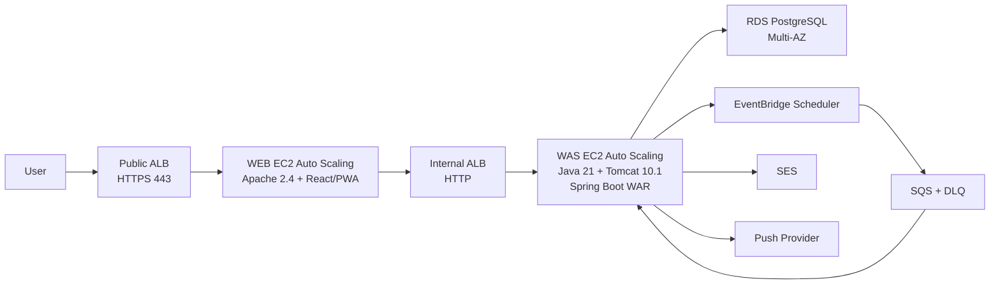

# Architecture v1.2

Status: Accepted for Phase 0  
Approved: 2026-08-13  
Region: `ap-northeast-2`

## 1. Decision summary

이 프로젝트는 과제에서 요구하는 Apache-Tomcat 연동과 WEB/WAS 분리를 실제 트래픽 경로로 보여준다.



## 2. Why this structure

### 과제 정합성

평가 자료는 Apache 설치, Tomcat/OpenJDK 설치, Proxy 또는 mod_jk 연동을 요구한다. EC2는 설치 과정, 프로세스, 포트, 로그를 증거로 남길 수 있다. Fargate도 같은 소프트웨어를 실행할 수 있지만 서버 구축 과정이 컨테이너 이미지 안으로 가려진다.

### 책임 분리

- Public ALB는 인터넷 진입과 TLS를 담당한다.
- Apache WEB은 정적 파일 제공과 `/api/*` Reverse Proxy를 담당한다.
- Internal ALB는 정상 Tomcat으로 요청을 분산한다.
- Tomcat WAS는 인증, 일정, 알림, 상태 전이를 처리한다.
- RDS는 업무 상태의 Source of Truth를 맡는다.

한 계층의 구현을 바꿔도 인접 계층의 계약을 유지할 수 있다. 팀원 네 명도 Frontend, Backend, Cloud, Integration 영역을 나누기 쉽다.

### 장애 격리와 검증

Public ALB와 Internal ALB가 WEB/WAS 상태를 따로 검사한다. 발표자는 WEB 인스턴스 한 대 또는 WAS 인스턴스 한 대를 중지하고 남은 인스턴스가 요청을 처리하는지 확인할 수 있다. Correlation ID를 사용하면 Public ALB, Apache, Tomcat 로그에서 한 요청을 추적할 수 있다.

## 3. Fundamental knowledge and project-specific choices

### 기본기로 익힐 내용

- HTTP 요청이 Load Balancer, Reverse Proxy, Application Server를 지나는 과정
- WEB과 WAS의 책임 차이
- Public, Private, Isolated Subnet과 Route Table
- Security Group 참조를 이용한 최소 권한 경로
- Stateless 애플리케이션과 Load Balancing
- Health Check, Auto Scaling, Multi-AZ, 장애 조치
- 로그, 메트릭, Correlation ID
- DB 트랜잭션과 외부 시스템 사이의 실패 처리

### 이 프로젝트에 맞춘 구현 선택

- Apache HTTP Server와 외장 Tomcat 조합
- WEB과 WAS 사이의 Internal ALB
- Spring Boot WAR 배포
- EventBridge Scheduler와 SQS 조합
- Regional NAT Gateway

Apache-Tomcat은 여러 기업 시스템에서 볼 수 있는 전통적 3-Tier 구현이다. 모든 현대 애플리케이션이 이 조합을 사용하지는 않는다. 기본 개념은 계층 분리, 프록시, 상태 관리, 장애 처리다. 제품 이름은 요구사항과 운영 환경에 따라 바뀐다.

## 4. WEB-Tomcat integration

권장 방식은 `mod_proxy_http + Internal ALB`다.

```text
Browser /api/*
-> Public ALB
-> Apache mod_proxy_http
-> Internal ALB DNS
-> Healthy Tomcat target:8080
```

Apache는 Tomcat 인스턴스 IP를 직접 알지 않는다. Internal ALB DNS만 사용한다. Internal ALB가 Target 등록, Health Check, 분산을 담당하므로 Apache의 자체 Balancer 기능은 사용하지 않는다.

`mod_jk`가 평가 항목으로 지정될 때만 `Apache mod_jk -> Internal NLB TCP 8009 -> Tomcat AJP`로 바꾼다. AJP를 사용할 때는 Secret과 좁은 Security Group 규칙이 필요하다.

## 5. Network design

| Tier | AZ-A | AZ-C | Route |
|---|---|---|---|
| Public | Public Subnet A | Public Subnet C | IGW |
| WEB | WEB Private A | WEB Private C | NAT |
| WAS | WAS Private A | WAS Private C | NAT |
| DB | DB Isolated A | DB Isolated C | Local only |

### Traffic and Security Groups

| Source | Destination | Port | Rule |
|---|---|---:|---|
| Internet | Public ALB SG | 443 | `0.0.0.0/0`, IPv6 사용 시 `::/0` |
| Public ALB SG | WEB SG | 80 | SG reference |
| WEB SG | Internal ALB SG | 80 | SG reference |
| Internal ALB SG | WAS SG | 8080 | SG reference |
| WAS SG | RDS SG | 5432 | SG reference |

WEB/WAS에는 SSH 22번을 열지 않는다. SSM Agent가 HTTPS Outbound 연결을 시작한다.

## 6. Compute and deployment

### WEB Tier

- EC2 Launch Template와 Auto Scaling Group
- Amazon Linux 2023
- Apache HTTP Server 2.4
- React/PWA build artifact를 Apache DocumentRoot에 배포
- `/healthz`는 Apache 상태만 검사
- `/api/*`는 Internal ALB로 전달

### WAS Tier

- 별도 Launch Template와 Auto Scaling Group
- Java 21, 외장 Tomcat 10.1
- Spring Boot 3.5 WAR
- WAR는 단순한 Context Path를 위해 `ROOT.war`로 배포
- `/actuator/health/readiness`를 Internal ALB Health Check로 사용
- 인스턴스 로컬 세션을 사용하지 않음

최종 HA 환경은 WEB 2대, WAS 2대를 두 AZ에 분산한다. 개발 환경은 비용을 줄이기 위해 각 계층 1대로 실행할 수 있지만 HA 증거로 사용하지 않는다.

## 7. NAT and administration

- 로컬: NAT 없음
- 단기 AWS 개발: Single Zonal NAT, 단일 장애점 기록
- HA 검증: Regional NAT Gateway Automatic
- 관리: SSM Session Manager
- Bastion: 만들지 않음

Regional NAT는 AZ별 사용 시간과 처리량 요금이 발생한다. 비용 절감 기능으로 설명하지 않는다. 두 AZ 아웃바운드 경로를 단순한 라우팅으로 구성하는 운영 선택이다.

## 8. Application and data

Spring Boot는 Controller, Application Service, Domain, Repository, Infrastructure Adapter를 분리한다. REST Controller와 MCP Adapter는 같은 Application Service를 호출한다.

초기 핵심 테이블:

- `app_user`
- `event`
- `reminder`
- `notification_policy`
- `notification_attempt`
- `schedule_outbox`
- `idempotency_record`

초기 상태:

```text
CREATED -> SCHEDULE_PENDING -> SCHEDULED -> DISPATCHED
-> DELIVERED -> ACKNOWLEDGED
```

실패 상태는 `SCHEDULE_FAILED`, `DELIVERY_FAILED`, `RETRYING`, `CANCELLED`로 제한한다.

## 9. Async and consistency

1. WAS가 Reminder와 Outbox를 한 DB 트랜잭션에 저장한다.
2. Outbox 처리기가 EventBridge Schedule을 등록한다.
3. Scheduler가 실행 시각에 SQS로 메시지를 보낸다.
4. WAS 소비자가 Reminder ID, Version, Idempotency Key를 검증한다.
5. Provider 응답과 전송 시도를 DB에 기록한다.
6. 반복 실패는 DLQ에 보내고 Reconciliation Job이 불일치를 찾는다.

LLM 응답은 성공 판정에 사용하지 않는다.

## 10. Scope control

### Must

- Apache-Tomcat 3-Tier 경로
- 자연어 입력의 구조화와 서버 검증
- Email 알림
- Scheduler, SQS, DLQ
- Idempotency와 Outbox
- 2-AZ WEB/WAS와 RDS Multi-AZ 증거
- 로그와 장애 시연

### Should

- Push 알림
- MCP `create_reminder`, `list_reminders`, `get_delivery_status`

### Later

- SMS
- WAF와 VPC Interface Endpoint
- Kubernetes, Kafka, Microservices

## 11. Fifteen-minute presentation

1. 문제와 Source of Truth 원칙: 1분
2. Apache-Tomcat 3-Tier 요청 경로: 3분
3. 자연어 Reminder 생성과 Email 실행: 4분
4. 실패, Retry, DLQ, 상태 기록: 3분
5. 보안, 2-AZ, 비용 선택: 3분
6. 한계와 확장: 1분

## 12. References

- Apache mod_proxy: https://httpd.apache.org/docs/2.4/en/mod/mod_proxy.html
- Tomcat AJP connector: https://tomcat.apache.org/tomcat-10.1-doc/config/ajp.html
- Spring Boot traditional WAR deployment: https://docs.spring.io/spring-boot/how-to/deployment/traditional-deployment.html
- AWS ALB target groups: https://docs.aws.amazon.com/elasticloadbalancing/latest/application/load-balancer-target-groups.html
- AWS Session Manager: https://docs.aws.amazon.com/systems-manager/latest/userguide/session-manager.html
- AWS Regional NAT Gateway: https://docs.aws.amazon.com/vpc/latest/userguide/nat-gateways-regional.html
